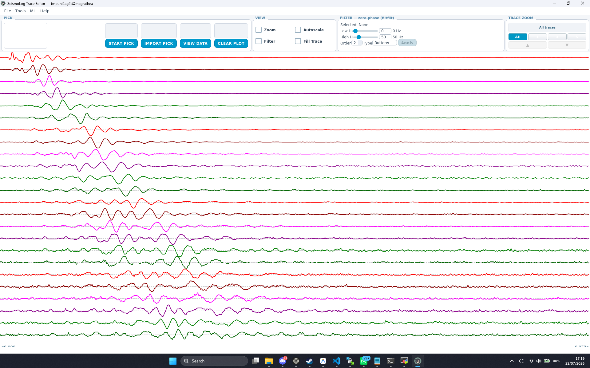

# TraceMax

A PyQt5 desktop application for seismic trace visualization, editing, filtering, first-break picking, and refraction analysis.

© 2022–2026 Rosandi & Arief Ritonga, Universitas Padjadjaran  
Licensed under the [GNU General Public License v3](LICENSE)

---

## Screenshots



---

## Features

- **Trace visualization** — Multi-trace seismogram display with zoom, scroll, and fill-plot modes
- **Filtering** — Real-time Butterworth / Chebyshev / Bessel bandpass filter with adjustable low/high frequency and order
- **Manual picking** — Click-to-pick first-break arrivals with a pick indicator line
- **STA/LTA auto-picker** — Configurable Short-Term / Long-Term Average ratio picker with waveform preview
- **Arrival time management** — Table view for editing offsets, deleting picks, and exporting `.dat` files
- **Hagiwara refraction analysis** — Single and two-direction (TAP/TBP) analysis with travel-time curves and 1D depth profiles
- **FFT spectrum viewer** — Frequency domain inspection of selected traces
- **Plugin system** — Drop-in plugins (e.g. ML auto-picker) loaded automatically at startup

---

## Requirements

- Python 3.9+
- PyQt5 ≥ 5.15
- NumPy ≥ 1.24
- SciPy ≥ 1.10
- Matplotlib ≥ 3.7

Install dependencies:

```bash
pip install -r requirements.txt
```

### Optional - ML Auto-Picker plugin

The ML plugin requires PyTorch and trained model weights:

```bash
pip install torch
```

Place model weights in `src/plugin/ml_picker/models/`:
- `best_model_bilstm.pt` — Bidirectional LSTM
- `best_model_unidirectional.pt` — Unidirectional LSTM

---

## Running from Source

```bash
python src/tracemax.py
```

Or open a data file directly:

```bash
python src/tracemax.py path/to/data.json
```

---

## Building Standalone Executables

TraceMax can be packaged into a standalone executable using [PyInstaller](https://pyinstaller.org/) with the included `tracemax.spec` file.

### Windows

```batch
build_windows.bat
```

To clean previous build artifacts first:

```batch
build_windows.bat clean
```

The executable will be at `dist\TraceMax\TraceMax.exe`.

### Linux

```bash
chmod +x build_linux.sh
./build_linux.sh
```

To clean previous build artifacts first:

```bash
./build_linux.sh clean
```

The executable will be at `dist/TraceMax/TraceMax`.

---

## Project Structure

```
src/
├── tracemax.py               # Entry point
├── main.py                   # App bootstrap, splash screen, restart loop
├── config.py                 # Config dict, CLI parsing, asset loading
├── app/
│   ├── __init__.py
│   ├── mainwindow.py         # Main window
│   ├── toolbar.py            # Top control panel (PICK/VIEW/FILTER/ZOOM)
│   ├── dialogs.py            # Help, FFT, and info dialogs
│   ├── arrival_dialog.py     # Arrival time table dialog
│   ├── stalta_dialog.py      # STA/LTA auto-picker dialog
│   └── hagiwara_dialog.py    # Hagiwara refraction analysis dialog
├── core/
│   ├── __init__.py
│   ├── trace_model.py        # Trace data model + DSP (no Qt rendering)
│   ├── plotter.py            # Canvas widget — render + events
│   ├── actions.py            # Editing operations (stateless free functions)
│   ├── autopick.py           # STA/LTA algorithm (pure numpy)
│   └── refraction.py         # Hagiwara analysis (pure numpy)
├── fileio/
│   ├── __init__.py
│   └── fileio.py             # JSON file open/save/combine
├── widgets/
│   ├── __init__.py
│   └── seiswidgets.py        # Reusable PyQt5 widget helpers
├── plugin/
│   ├── __init__.py           # Plugin discovery system
│   └── ml_picker/            # ML auto-picker plugin
│       ├── __init__.py
│       ├── README.md
│       ├── lstm_base.py
│       ├── lstm_model.py
│       ├── lstm_model_unidirectional.py
│       ├── ml_preprocess.py
│       ├── ml_picker_dialog.py
│       └── models/           # Place .pt weight files here
└── assets/
    ├── seismolog.css          # Application stylesheet
    ├── strings.json           # UI strings (i18n)
    ├── logotransparent.png    # Transparent logo
    ├── newlogo.png            # Application logo
    ├── tracemax.png           # Application icon (PNG)
    └── tracemax.ico           # Application icon (ICO)
```

---

## Data Format

TraceMax reads JSON files with the following structure:

```json
{
  "time": [0.0, 0.001, 0.002, ...],
  "channel-00": [0.12, -0.05, ...],
  "channel-01": [0.08, 0.03, ...],
  ...
}
```

---

## License

This project is licensed under the **GNU General Public License v3**.  
See [LICENSE](LICENSE) for the full text.
