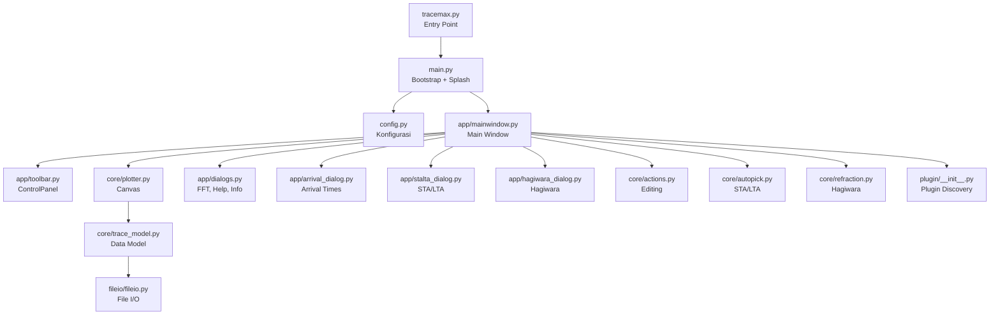

# Struktur Proyek

## Arsitektur

## Prinsip Desain

1. **Pemisahan UI dan logika**: modul `core/` adalah pure Python + NumPy, tidak ada dependency Qt. Bisa diuji dan digunakan secara independen.
2. **Stateless editing**: semua operasi di `actions.py` adalah free functions yang menerima canvas sebagai parameter.
3. **Plugin modular**: plugin di-discover otomatis tanpa registrasi manual.
4. **Double-buffered rendering**: `plotter.py` menggunakan `QPixmap` untuk render tanpa flicker.

## Modul

### Entry Point

| File | Fungsi |
|---|---|
| `tracemax.py` | Entry point, memanggil `main()` |
| `main.py` | Bootstrap: splash screen (600×320, gradient), restart loop via `_restart_flag` |
| `config.py` | Config dict, CLI parsing (`gui=key:value`), asset loading (CSS + strings.json) |

### `app/` — UI Layer

| File | Fungsi |
|---|---|
| `mainwindow.py` | `SeismoWin(QMainWindow)` — koordinator utama, menu, signal/slot wiring |
| `toolbar.py` | `ControlPanel(QFrame)` — 4 grup: PICK, VIEW, FILTER, TRACE ZOOM |
| `dialogs.py` | `helpDialog`, `FFTDialog` (Matplotlib), `infoDialog` |
| `arrival_dialog.py` | `ArrivalTimeDialog` — tabel modeless, ekspor `.dat` |
| `stalta_dialog.py` | `STALTADialog` — preview 2-panel Matplotlib |
| `hagiwara_dialog.py` | `HagiwaraDialog` — 4 tab, model 2D cross-section |

### `core/` — Domain Logic

| File | Fungsi |
|---|---|
| `trace_model.py` | Class `trace` — data model per channel, filtering (`filtfilt`), normalisasi |
| `plotter.py` | `plotter(QFrame)` — canvas, min-max decimation, mouse/keyboard handling |
| `actions.py` | Free functions: select, move, delete, mute, cut, stack, pick |
| `autopick.py` | STA/LTA: `sta_lta_ratio()`, `pick_first_break()`, `ms_to_samples()` |
| `refraction.py` | Hagiwara: regresi, crossover detection, single/two-direction analysis |

### `fileio/` — I/O

| File | Fungsi |
|---|---|
| `fileio.py` | `open_data()` (background thread + progress dialog), `save_data()`, `combine_data()` |

### `widgets/` — Widget Reusable

| File | Fungsi |
|---|---|
| `seiswidgets.py` | `cmdButton`, `chkButton`, `bigLabel`, `statusText`, `scroller`, `scrollLabel` |

### `plugin/` — Plugin System

| File | Fungsi |
|---|---|
| `__init__.py` | `discover_plugins()` — scan, import, register |
| `ml_picker/` | ML Auto-Picker: LSTM model, preprocessing, dialog |

### `assets/`

| File | Fungsi |
|---|---|
| `seismolog.css` | Stylesheet Qt |
| `strings.json` | Localization (en/id) |
| `*.png`, `*.ico` | Logo dan ikon |

## Alur Data

1. `fileio.py` membaca JSON di background thread, menampilkan progress dialog
2. `trace_model` menyimpan data per channel (raw + view data, filter state, pick state)
3. `plotter` merender trace ke `QPixmap` dengan min-max decimation
4. Interaksi user → `actions.py` → update `trace_model` → repaint `plotter`
5. Saat save, `fileio.py` serialisasi semua state (data, scale, offset, filter, pick, config) ke JSON
